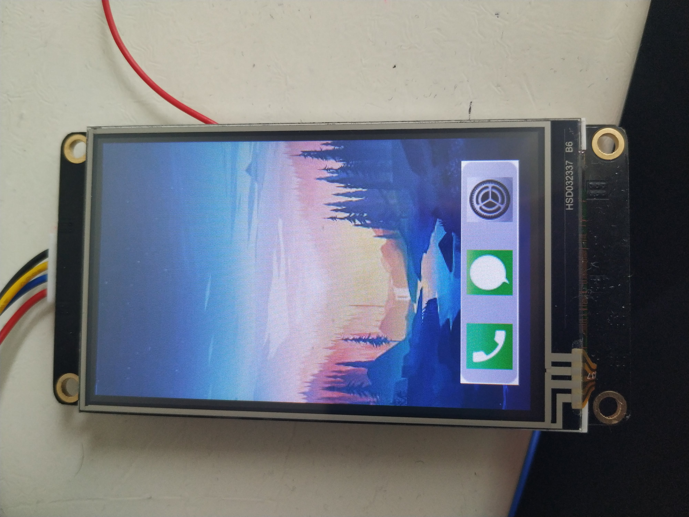
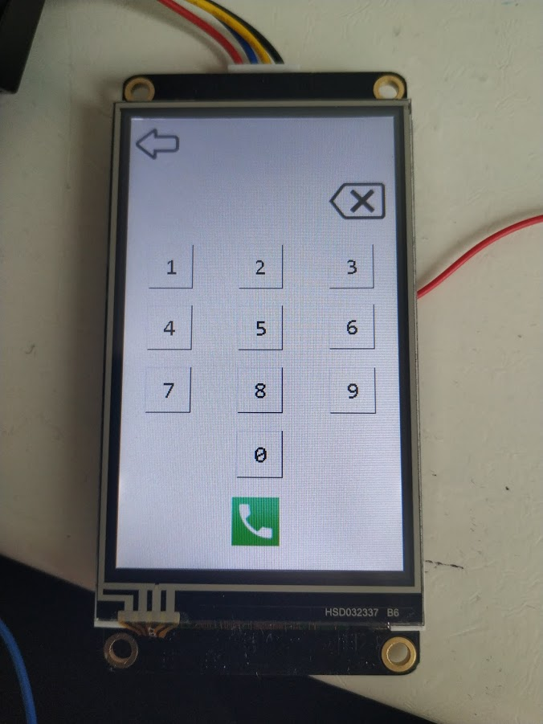
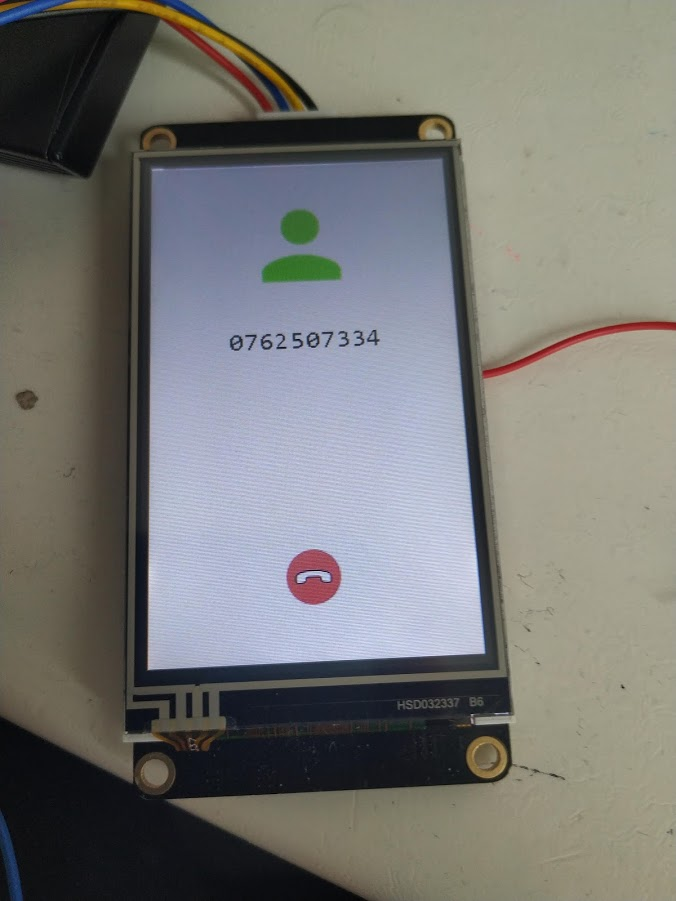
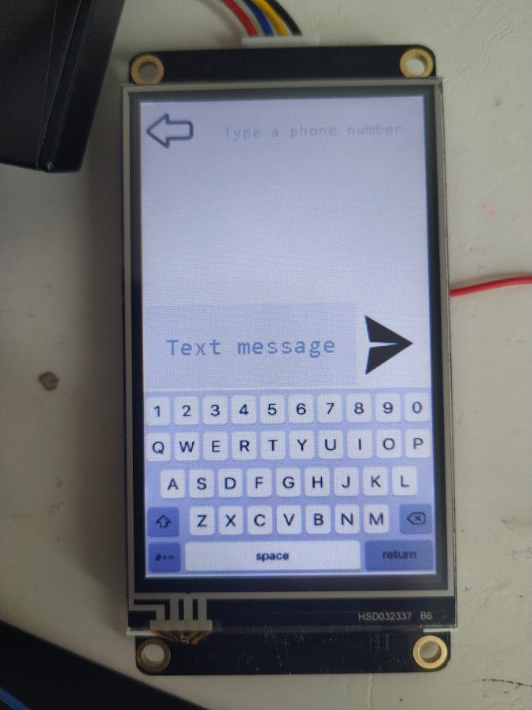
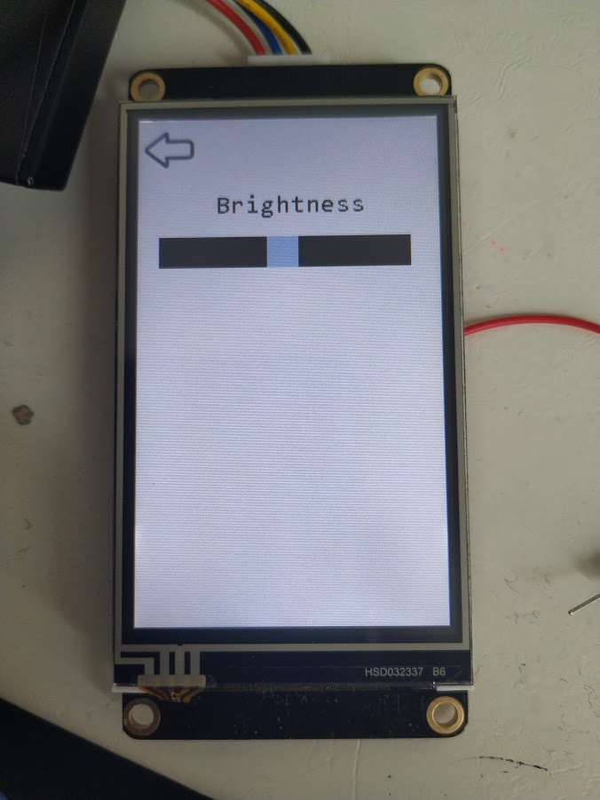

# ArduinoPhone
A phone designed with Arduino Uno, SIM900 GSM GPRS Shield and Nextion Display.

## Things used in this project
### Hardware components
* Arduino Uno
* SIM900 GSM GPRS Shield
* Itead Nextion NX4024T032 - Generic 3.2" HMI TFT Intelligent LCD Touch Display Module
* SIM card
* Jumper wires
### Software apps and online services
* [Arduino IDE](https://www.arduino.cc/en/main/software)
* [Nextion Editor](https://nextion.itead.cc/resources/download/nextion-editor/)
* [jspaint](https://jspaint.app/#local:40308c9382ae9)
* [Invert Images](https://pinetools.com/invert-image-colors)
* [Resize Images](https://resizeimage.net/)

## Story
The phone is capable of the following National(only Romania) features:
* Make Calls
* Send SMS
* Receive SMS
* Adjust Brightness

In this project, I used the SIM900 GSM GPRS Shield to connect to the mobile network. It is an all-in-one cellular shield that lets you add voice, SMS and data to your projects. It works on frequencies 900/1800MHz and comes with the friendly RS232 which can be easily interfaced with any MCUs, the baud rate is adjustable from 9600 – 115200 through AT Commands.

I also used a display to visualize GUI interfaces, I selected an LCD touch display by Nextion. Nextion adopts a new and easy way to interface any of your projects through UART. Its easy-to-use configuration software (Nextion Editor) allows you to design your own interfaces using GUI commands and makes the pieces of your development effortless, in turn you can save lots of program space in your MCUs.

On its own, the GSM module and the Nextion touch display can’t do anything. It requires a microcontroller to drive it. At the heart is an Arduino Uno to drive the phone, which can send and receive commands over its RX/TX pins.

## Wiring
Connect the GSM module and the Nextion Display to your Arduino by following the appropriate steps below.
* Nextion +5V to Arduino VDD_5v
* Nextion RX to Arduino pin 11
* Nextion Tx to Arduino pin 10
* Nextion GND to Arduino GND_0v
* GSM Rx to Arduino pin 8
* GSM TX to Arduino pin 7
* GSM GND to Arduino GND_0v

# Photos

## Demonstrative Video
[Link](https://photos.app.goo.gl/D7gRWPsD8u2miHMe7)

## Author 
* Auras Popescu